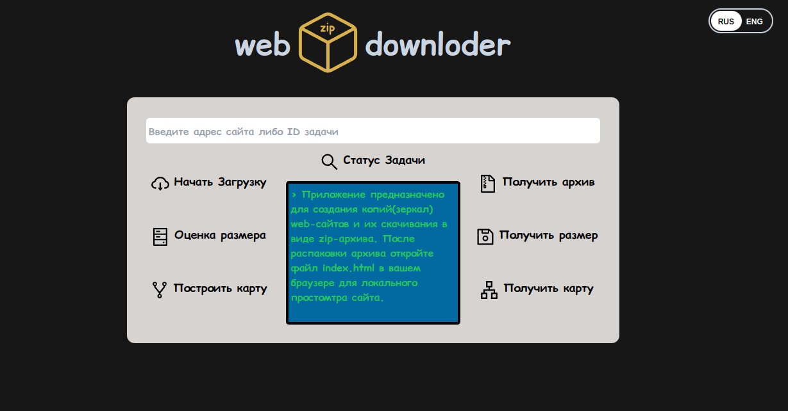
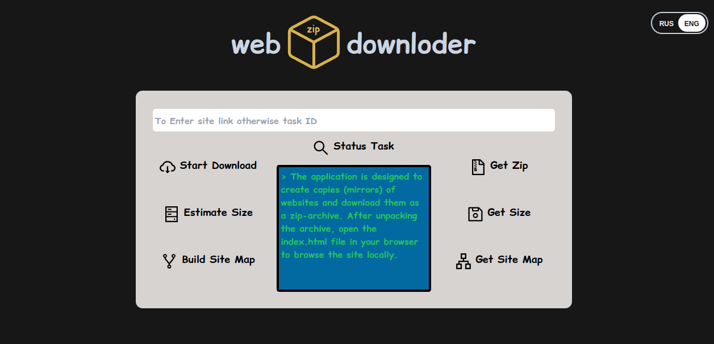

# WebDownloaderFrontend

## Frontend for [WebDownloader](https://github.com/acdemeg/WebDownloader) App
Follow above link for more details

## DEMO
http://devproject.site:8002

## DockerHub
https://hub.docker.com/repository/docker/acdemeg/web-downloader/general

## Preview
* RUS

* ENG

